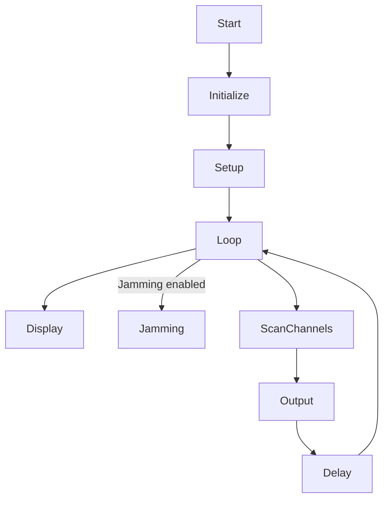

# Overview
The code provided is a modified version of the nRF-jammer project available on GitHub. It utilizes an Arduino board, an SSD1306 OLED display, and an NRF24L01 module to scan and display activity levels on 2.4GHz channels. The program allows for channel selection and provides the option to enable jamming on a specific channel.  

## Pinout
The following table shows the pinout configuration used in the code:

| Pin   | Function                      |
|-------|-------------------------------|
| BT1   | Button 1 pin (channel select) |
| BT2   | Button 2 pin (jamming toggle) |
| CE    | NRF24L01 Chip Enable pin      |
| SDA   | I2C data pin for SSD1306      |
| SCL   | I2C clock pin for SSD1306     |

Please ensure that you connect the corresponding pins on your Arduino board.

## Program Flowchart



<!--
  This flowchart represents the program flow of the modified and adapted code.
  Original code available at: https://github.com/cifertech/nRF-jammer
  Modified and adapted by [Your Name] for specific requirements.
-->

## flowchart explanation
```
Start
|
+-- Initialize I2C display and NRF24 module
|
+-- Enter setup routine
|   |
|   +-- Initialize variables and display
|   |
|   +-- Set NRF24 module configuration
|   |
|   +-- Enter loop routine
|
+-- Enter loop routine
    |
    +-- Clear display and set text size/color
    |
    +-- Display current channel on the OLED display
    |
    +-- If jamming is enabled
    |   |
    |   +-- Display jamming channel on the OLED display
    |   |
    |   +-- Configure NRF24 module for jamming
    |   |
    |   +-- Enter jamming loop
    |
    +-- Scan channels and calculate activity levels
    |
    +-- Output activity levels on the OLED display
    |
    +-- Delay for a short period
|
End
```

  This program is based on the code available at:
  https://github.com/cifertech/nRF-jammer
  Modified and adapted to use an i2c oled display module.
