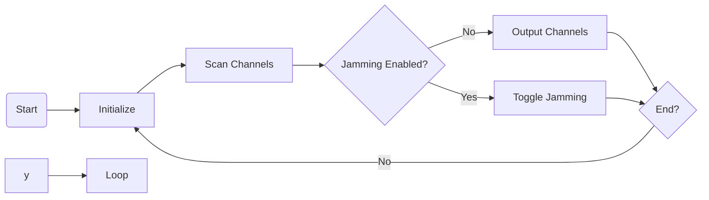

# general

This program enables an ESP8266 board to function as a 2.4GHz scanner, capable of scanning and analyzing the signal strength of different channels. It utilizes the NRF24L01 radio module and an OLED display to visualize the channel information.

## Credits

This program is inspired by and based on the [nRF-Jammer](https://github.com/cifertech/nRF-jammer) project by [CiferTech](https://github.com/cifertech). It has been adapted and modified to work with the ESP8266 board.

## Pinout

The pinout configuration for the components used in this program is as follows:

| Component       | ESP8266 Pin | Default Pin |
| --------------- | ----------- | ----------- |
| OLED Display    | SDA         | D2          |
| OLED Display    | SCL         | D1          |
| OLED Display    | RST         | D4          |
| NRF24L01 Radio  | CE          | D7          |
| NRF24L01 Radio  | CSN         | D8          |
| Button 1        |             | D2          |
| Button 2        |             | D3          |

Please note that the pin assignments may need to be adjusted based on your specific wiring configuration.

## Flowchart

The flowchart represents the basic operation of the ESP8266 2.4GHz scanner. It starts with the initialization step, followed by scanning the channels. If jamming is not enabled, the channel information is outputted. The flow continues until the end is reached. If jamming is enabled, it toggles the jamming on the current channel and then proceeds to the next iteration.

For a detailed explanation of the flowchart, please refer to the [Flowchart Explanation](#flowchart-explanation) section.

## Flowchart Explanation

1. Start: The program execution starts at this point.
2. Initialize: Initialization step where the necessary components, such as the OLED display and NRF24L01 radio, are set up and configured.
3. Scan Channels: The program scans the 2.4GHz frequency channels using the NRF24L01 radio to measure the signal strength of each channel.
4. Jamming Enabled?: Check if jamming is enabled or not.
   - No: If jamming is not enabled, proceed to the next step.
     - Output Channels: Display the signal strength of each channel on the OLED display.
     - End?: Check if the program has reached its end condition.
       - No: If not, go back to the initialization step to continue scanning.
   - Yes: If jamming is enabled, toggle the jamming on the current channel and proceed to the next iteration.
     - Toggle Jamming: Activate or deactivate the jamming mechanism on the current channel.
     - End?: Check if the program has reached its end condition.
       - No: If not, go back to the initialization step to continue scanning.
